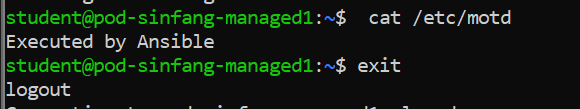
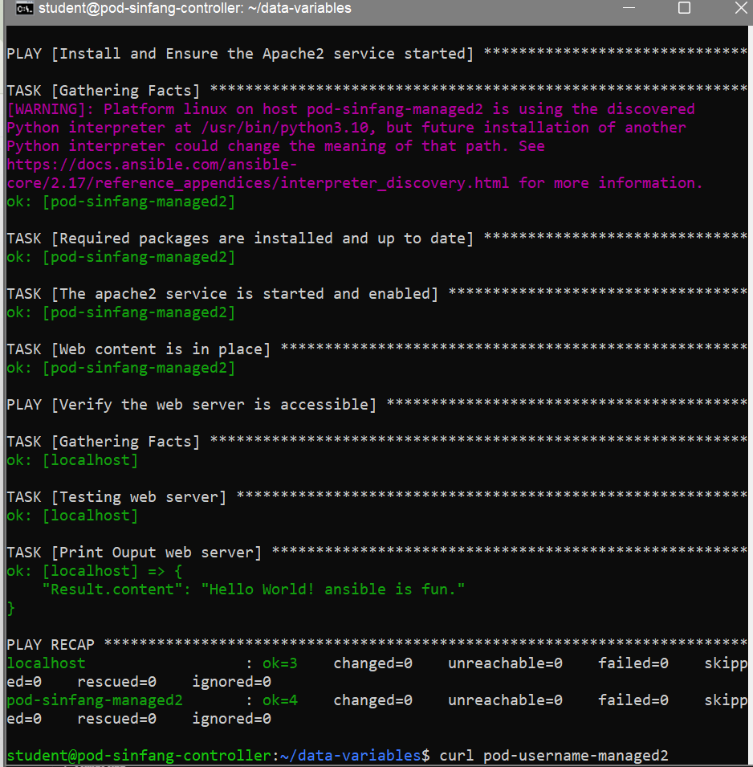

## AD-hoc

Tujuan:
1. Mengenal penggunaan Ansible ad-hoc command untuk mengontrol node secara remote.
2. Melakukan eksekusi perintah sederhana di semua node dengan modul command.
3. Mengeksplorasi modul Ansible lain seperti setup (facts gathering) dan copy (update file).
4. Melatih penggunaan privilege escalation (--become) pada Ansible.

langkah-langkah pengerjaan:

-  Menampilkan hostname semua server.
    ```bash
    ansible all -m command -a "hostname"
    ```

- Menampilkan informasi detail (facts) dari server managed1
    ```bash
    ansible pod-username-managed1 -m setup
    ```

- Mengecek informasi user di localhost
    ```bash
    ansible localhost -m command -a 'id'
    ansible localhost -u student -m command -a 'id'
    ```

- Mengubah isi file /etc/motd
    ```bash
    ansible pod-username-managed1 --become -u student \
    -m copy -a "content='Executed by Ansible\n' dest=/etc/motd"
    ```

- Mengecek isi file /etc/motd lewat Ansible
    ```bash
    ansible pod-username-managed1 -u student -m command -a 'cat /etc/motd'
    ```

- Mengecek langsung dengan SSH
    ```bash
    ssh pod-username-managed1
    cat /etc/motd
    exit
    ```




## Manage Ansible Inventory

Tujuan:
1. Membuat custom inventory Ansible
   - Inventory adalah daftar host (server) yang akan dikelola Ansible.
   - Kamu akan membuat file inventory sendiri sesuai spesifikasi.

2. Mengelompokkan host ke dalam grup berdasarkan:
   - Lokasi (Bogor, Jakarta)
   - Purpose (WebServers)
   - Environment (Testing, Development)
   - Custom group (Indonesia)

3. Mengelola host ungrouped (host yang tidak termasuk grup, misalnya pod-sinfang-controller).

4. Memverifikasi inventory
   - Mengecek daftar host per grup.
   - Mengecek daftar host ungrouped.
   - Mengecek daftar host dari custom group.

langkah-langkah pengerjaan:

- Buat direktori kerja
    ```bash
    mkdir ~/managing-inventory
    cd ~/managing-inventory
    ```

- buat file inventory sesuai dengan isi dile yang ada di directory yang saya buat dengan nama "inventory1".
    ```bash
    sudo nano inventory
    ```

- Verifikasi host di inventory

    - Cek semua host:
    ```bash
    ansible all -i inventory --list-hosts
    ```

    - Cek host ungrouped:
    ```bash
    ansible ungrouped -i inventory --list-hosts
    ```

    - cek host tertentu:
    ```bash
    ansible pod-sinfang-managed1 -i inventory --list-hosts
    ansible Development -i inventory --list-hosts
    ansible Testing -i inventory --list-hosts
    ansible Indonesia -i inventory --list-hosts
    ```

## Managing Ansible Configuration files

Tujuan:
1. Membuat file konfigurasi Ansible (ansible.cfg) → supaya perintah Ansible lebih ringkas (nggak perlu pakai opsi -i atau set user setiap kali).
2. Mengatur custom inventory → menyimpan daftar server yang dikelola.
3. Menggunakan Ansible ad-hoc command untuk menjalankan perintah langsung ke banyak server.
4. Mengelola file konfigurasi server secara otomatis → contoh menyalin pesan ke /etc/motd di semua server.
5. Memverifikasi hasil otomatisasi dengan login manual via ssh

langkah-langkah pengerjaan:

- Buat direktori kerja
    ```bash
    cd ~/
    mkdir -p deploy-review
    cd deploy-review
    ```

- Buat file konfigurasi Ansible
    ```bash
    sudo nano ansible.cfg
    ```
Isinya: lihat file "ansibel1.cfg"
Artinya:
    - inventory = ./inventory → gunakan file inventory di direktori ini.
    - remote_user = student → user default untuk SSH ke server.
    - host_key_checking = False → biar nggak ada prompt konfirmasi saat pertama kali SSH.

- Buat inventory
    ```bash
    sudo nano inventory
    ```
Isinya: lihat file "inventory2"

- Jalankan Ansible ad-hoc command
    Cek user ID:
    ```bash
    ansible servers -m command -a 'id'
    ```

    Copy message ke /etc/motd (Message of the Day):
    ```bash
    ansible servers -m copy -a "content='This server is managed by Ansible. \n' dest=/etc/motd" --become
    ```

    Verifikasi hasilnya:
    ```bash
    ansible servers -m command -a 'cat /etc/motd'
    ```

- Login manual untuk memastikan
    ```bash
    ssh pod-sinfang-managed1 "whoami; cat /etc/motd"
    ssh pod-sinfang-managed2 "whoami; cat /etc/motd"
    ```


## Writing and Running Playbooks

Tujuan:
1. Belajar menulis Ansible Playbook → kumpulan instruksi otomatisasi yang bisa dijalankan berulang.
2. Menggunakan Playbook untuk provisioning webserver (Apache2).
3. Mengelola file konfigurasi (index.html) ke server target.
4. Memastikan layanan berjalan otomatis (service Apache berjalan dan enabled).
5. Melakukan verifikasi bahwa server benar-benar meng-host halaman web.

Langkah Penyelesaian:

- Buat direktori kerja
    ```bash
    mkdir -p playbook-basic/files
    cd playbook-basic
    ```

- Buat file konfigurasi Ansible
    ```bash
    sudo nano ansible.cfg
    ```

Isinya: "ansible2.cfg"

- Buat inventory
    ```bash
    sudo nano inventory
    ```

Isinya: "inventory3"

- Buat file HTML (konten web)
    ```bash
    echo "This is a test page." > files/index.html
    ```

- Tulis playbook site.yml
    ```bash
    sudo nano site.yml
    ```

Isinya: "site.yml"

- Jalankan playbook
    ```bash
    ansible-playbook site.yml
    ```


8. Verifikasi webserver
    ```bash
    curl pod-username-managed1
    ```


## Managing Variables

Tujuan:
1. Menulis playbook Ansible yang menggunakan variables untuk:
    - Menginstall Apache2 dan Python package.
    - Menyalakan dan mengaktifkan service Apache2.
    - Menyediakan konten web sederhana.
2. Memverifikasi akses ke web server dengan Ansible (uri module) dan manual (curl).

Langkah Penyelesaian:

- Buat direktori kerja
    ```bash
    mkdir data-variables
    cd data-variables
    ```

- Buat file ansible.cfg

Isinya: "ansible3.cfg"

- Buat file inventory

Isinya: "inventory4"

- Buat playbook.yml

Isinya: "playbook.yml"

- Jalankan playbook
    ```bash
    ansible-playbook --syntax-check playbook.yml
    ansible-playbook playbook.yml
    ```



- Verifikasi webserver
    ```bash
    curl pod-username-managed2
    ```


## USing Jinja2 Template

Tujuan:
1. Belajar menggunakan Jinja2 template di Ansible.
2. Deploy Apache2 web server.
3. Generate file HTML secara dinamis dari template .j2.
4. Memverifikasi hasil dengan curl.

Langkah Penyelesaian:

- Buat direktori
    ```bash
    mkdir jinja2-template
    cd jinja2-template
    ```

- Buat inventory

Isinya: "inventory5"

-  Buat site.yml

Isinya: "site2.yml"

- Buat template Jinja2

File: sinfang.html.j2

Isinya: "sinfang.html.j2"

- Jalankan playbook
    ```bash
    ansible-playbook -i inventory site.yml
    ```


- Verifikasi
    ```bash
    curl pod-sinfang-managed1/sinfang.html
    ```

