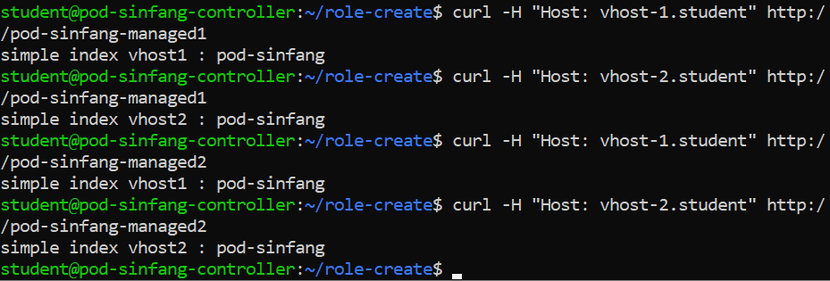
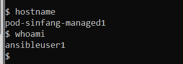
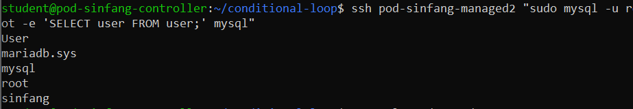

## Managing Roles

Tujuan:
1. Mempelajari konsep roles pada Ansible sebagai cara modularisasi konfigurasi.
2. Membuat role myvhost untuk mengonfigurasi Apache2 Virtual Host secara otomatis.
3. Menggunakan template Jinja2 untuk membangun file konfigurasi virtual host.
4. Memastikan web server dapat berjalan dengan dua vhost berbeda pada dua managed server.
5. Memahami penggunaan pre_tasks dan post_tasks dalam playbook.

Langakh Pengerjaan:

- Membuat direktori kerja:
    ```bash
    mkdir role-create
    cd role-create
    ```

- Buat file konfigurasi Ansible:
    - ansible.cfg   "ansible.cfg"
    - inventory     "inventory1"

- Membuat dirictory role
    ```bash
    mkdir roles
    cd roles
    ansible-galaxy init myvhost
    rm -rvf myvhost/{defaults,vars,tests}
    cd ..
    ```

- Tambahkan direktori untuk HTML:
    ```bash
    mkdir -p roles/myvhost/files/html-1
    mkdir -p roles/myvhost/files/html-2
    echo 'simple index vhost1 : pod-sinfang' > roles/myvhost/files/html-1/index.html
    echo 'simple index vhost2 : pod-sinfang' > roles/myvhost/files/html-2/index.html
    ```

- isi directory roles
    - Membuat tasks
        
        Isinya: roles/tasks/main.yml

    - Membuat handlers

        Isinya: roles/handlers/main.yml

    - Membuat template

        Isinya: roles/templates/vhost-1.conf.j2
        Isinya: roles/templates/vhost-2.conf.j2

Role = cara modularisasi playbook.
tasks/ = isi utama langkah-langkah otomatisasi.
handlers/ = aksi khusus (misalnya restart service).
templates/ = file dinamis dengan variabel (pakai Jinja2).

- Membuat playbook

    Isinya: use-vhost-role.yml


- Syntax check:
    ```bash
    ansible-playbook use-vhost-role.yml --syntax-check
    ```

- Jalankan playbook:
    ```bash
    ansible-playbook use-vhost-role.yml
    ```

- Verifikasi
    Cek hasil konfigurasi vhost di masing-masing managed server:
    ```bash
    curl -H "Host: vhost-1.student" http://pod-username-managed1
    curl -H "Host: vhost-2.student" http://pod-username-managed1
    curl -H "Host: vhost-1.student" http://pod-username-managed2
    curl -H "Host: vhost-2.student" http://pod-username-managed2
    ```
    

Kesimpulan:
1. Roles memudahkan strukturisasi konfigurasi Ansible sehingga lebih modular dan reusable.
2. Konfigurasi Apache2 dengan 2 Virtual Host berhasil di-deploy secara otomatis ke seluruh webserver.
3. Menggunakan template Jinja2 memungkinkan konfigurasi yang dinamis sesuai variabel Ansible.

## Managing Secrets

Tujuan:
1. Mengamankan informasi sensitif (seperti username dan password) menggunakan Ansible Vault.
2. Membuat user di server target menggunakan data terenkripsi.
3. Praktik keamanan: tidak menaruh password dalam playbook secara langsung.

Langkah Penyelesaian:

- Buat direktori kerja
    ```bash
    mkdir data-secret
    cd data-secret
    ```

- Buat konfigurasi Ansible:
    - ansible.cfg   "ansible.cfg2"
    - inventory     "inventory2"
    - secret.yml    "secret.yml"

- Enkripsi file secret
    ```bash
    ansible-vault encrypt secret.yml
    ```
    Masukkan password vault: adinusa88
    Confirm password: adinusa88

- Jika ada error permission, pastikan file dimiliki oleh user yang aktif:
    ```bash
    sudo chown student:student secret.yml
    ```

- Buat playbook untuk membuat user

Isi create_users.yml "create_users.yml"

-  Pastikan passlib terpasang
Ansible membutuhkan modul Python passlib untuk membuat hash password.
    ```bash
    sudo apt update
    sudo apt install -y python3-passlib
    ```

- Syntax-check playbook
    ```bash
    ansible-playbook --syntax-check --vault-password-file=vault-pass create_users.yml
    bash

- Jalankan playbook
    ```bash
    ansible-playbook --vault-password-file=vault-pass create_users.yml
    ```

- Verifikasi user
SSH ke host untuk memastikan user dibuat:
    ```bash
    ssh ansibleuser1@pod-username-managed1
    ```



## Conditional and loop

Tujuan:
1. Conditional – Menjalankan tugas hanya jika kondisi tertentu terpenuhi, misalnya:
    - Sistem operasi yang didukung
    - Minimal kapasitas RAM
2. Looping – Mengulangi tugas untuk beberapa item, misalnya:
    - Membuat grup user
    - Membuat user database
3. Memahami konsep include_tasks untuk memecah playbook menjadi beberapa file modular.
4. Mengelola hak akses user di MySQL sesuai peran (dbadmin atau dbuser).

Langkah-langkah Pelaksanaan:

- Buat direktori kerja
    ```bash
    mkdir conditional-loop
    cd conditional-loop
    ```

- Buat konfigurasi Ansible:
    - ansible.cfg               "ansible2.cfg" 
    - inventory                 "inventory3"
    - database_setup.yml        "database_setup.yml"
    - Ubuntu_database_tasks.yml "Ubuntu_database_tasks.yml"
    - database_user_tasks.yml   "database_user_tasks.yml"
    - database_server.yml       "group_vars/database_servers.yml:
    - all.yml                   "group_vars/all.yml"

- Menjalankan Playbook
    ```bash
    ansible-playbook --syntax-check database_setup.yml
    ansible-playbook database_setup.yml
    ```

- Verifikasi
    ```bash
    ssh ansibleadmin@pod-sinfang-managed2 "sudo mysql -u root -e 'SELECT user FROM mysql.user;'"
    ```

