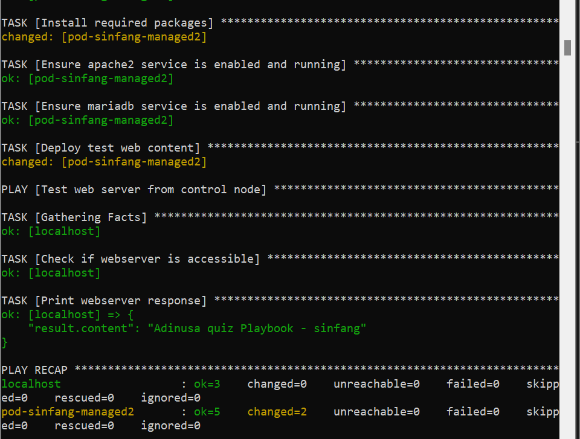
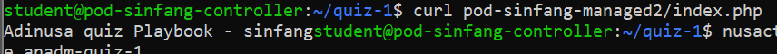
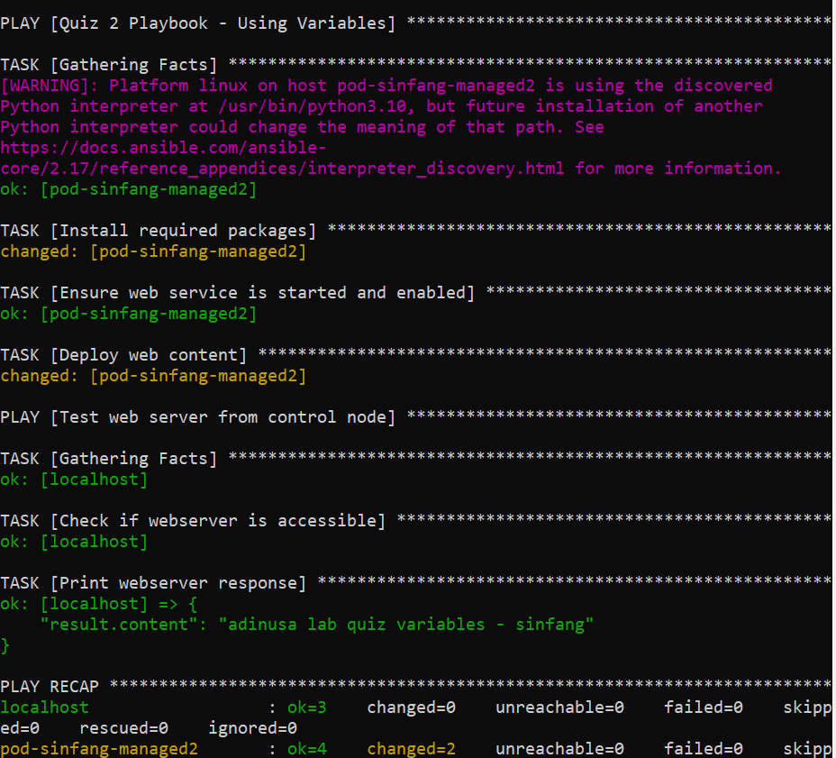
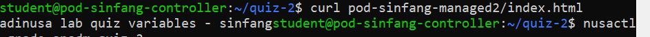
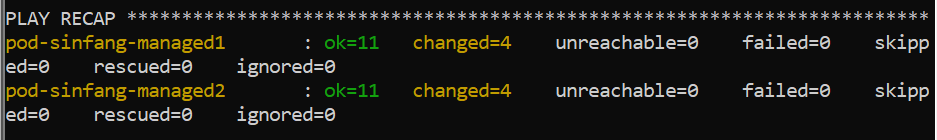
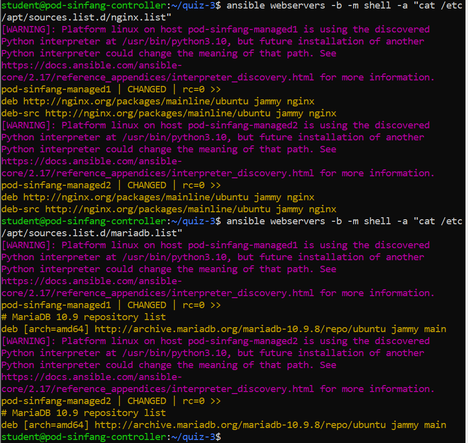
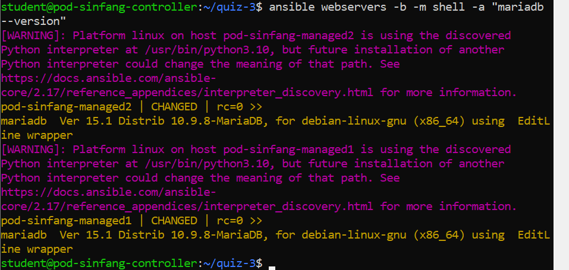
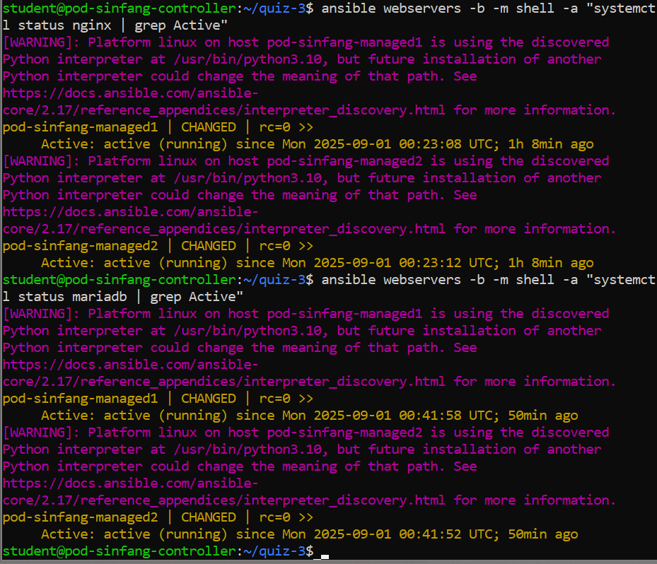
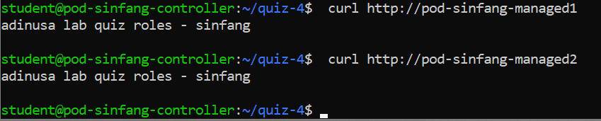

## Quiz 1: Playbook

Tujuan:
1. Membuat konfigurasi ansible.cfg dan inventory untuk mendefinisikan target host.
2. Menulis playbook yang:
    - Menginstal paket-paket penting (Apache2, MariaDB, PHP, PHP-MySQL).
    - Memastikan service Apache2 dan MariaDB berjalan dan otomatis aktif saat boot.
    - Meng-deploy konten web sederhana di /var/www/html/index.php.
3. Menambahkan play kedua untuk melakukan verifikasi dari control node dengan Ansible module uri.
4. Membuktikan bahwa Ansible mampu mengotomatisasi instalasi, konfigurasi, dan pengujian dalam satu eksekusi.

Kegunaan Praktis:
Dengan pendekatan ini, administrator dapat men-setup server LAMP (Linux + Apache + MariaDB + PHP) hanya dengan satu perintah, serta memastikan server berfungsi tanpa harus menguji manual satu per satu.

Implementasi Langkah:

- Membuat direktori kerja
    ```bash
    mkdir quiz-1
    cd quiz-1

- Membuat file ansible.cfg

Isinya: "ansible.cfg"

- Membuat file inventory

Isinya: "inventory1"

- Membuat playbook quiz-1_playbook.yml

Isinya: "quiz-1_playbook.yml"

- Eksekusi Playbook
    - Cek syntax:
    ```bash
    ansible-playbook --syntax-check quiz-1_playbook.yml
    ```
    - Jalankan playbook:
    ```bash
    ansible-playbook quiz-1_playbook.yml
    ```



- Verifikasi manual:
    ```bash
    curl pod-sinfang-managed2/index.php
    ```



 
Kesimpulan:
Quiz ini membuktikan bahwa Ansible Playbook dapat digunakan untuk:
1. Mengotomatiskan instalasi LAMP stack.
2. Mengelola service secara konsisten di server target.
3. Melakukan verifikasi otomatis dari control node.
Dengan playbook ini, proses yang biasanya dilakukan manual (instalasi paket, konfigurasi service, menyalin file, pengujian web server) dapat dijalankan secara reproducible, cepat, dan minim error.

## Quiz 2: Variables

Tujuan:
1. Lebih fleksibel → cukup ubah nilai variabel, tidak perlu edit ulang semua task.
2. Lebih konsisten → variabel yang dipakai di banyak tempat tetap sama nilainya.
3. Lebih mudah dikelola → terutama saat daftar paket, nama service, atau path file bisa berubah sesuai kebutuhan.

Konsep Dasar & Kegunaan
1. vars section di Playbook → tempat mendefinisikan variabel.
2. Variabel dipanggil menggunakan format {{ variable_name }}.
Contoh penggunaan:
    - name: "{{ required_Pkg }}" untuk menginstall paket.
    - name: "{{ web_Service }}" untuk mengelola service.
    - content: "{{ content_File }}" dan dest: "{{ dest_File }}" untuk menyalin file.
Dengan cara ini, playbook bisa digunakan kembali untuk banyak skenario dengan hanya mengganti nilai variabel.

Implementasi Langkah:

- Buat direktori kerja
    ```bash
    mkdir quiz-2
    cd quiz-2
    ```

- Buat file ansible.cfg

Isinya: "ansnible.cfg"

- Buat file inventory

Isinya: "inventory1"

- Buat playbook quiz-2_variables.yml

Isinya: quiz-2_variables.yml

- Eksekusi Playbook
    - Cek syntax:
    ```bash
    ansible-playbook --syntax-check quiz-2_variables.yml
    ```
    Jalankan playbook:
    ```bash
    ansible-playbook quiz-2_variables.yml
    ```



- Verifikasi manual:
    ```bash
    curl pod-sinfang-managed2/index.html
    ```



Kesimpulan:
Quiz ini menunjukkan bahwa penggunaan variabel dalam Ansible membuat playbook lebih modular, efisien, dan reusable.
Hanya dengan mengubah nilai variabel, playbook bisa digunakan ulang di host berbeda tanpa perlu menulis ulang seluruh task.

## Quiz 3: Jinja 2 template

Tujuan:
Membuat playbook Ansible menggunakan Jinja2 Template untuk mengonfigurasi repository nginx dan MariaDB, kemudian menginstal versi paket tertentu serta memastikan service berjalan dengan baik di managed server.

Langkah penyelesaian:

- buat direktory kerj
    ```bash
    mkdir quiz-3
    cd quiz-3
    ```

- buat file-file berikut:
    - ansible.cfg               = "ansible.cfg"
    - inventory                 = "inventory2"
    - quiz-3_j2template.yml     = "quiz-3_j2template.yml"
    - nginx.list.j2             = "nginx.list.j2"
    - mariadb.list.j2           = "mariadb.list.j2"

    dapat kita lihat isi file-file berikut dalam direcktory yang saya buat.

- Eksekusi Playbook
    ```bash
    ansible-playbook quiz-3_j2template.yml
    ```



- Verifikasi
    - cek file repository
    ```bash
    ansible webservers -b -m shell -a "cat /etc/apt/sources.list.d/nginx.list"
    ansible webservers -b -m shell -a "cat /etc/apt/sources.list.d/mariadb.list"
    ```

    

    - cek versi 
    ```bash
    ansible webservers -b -m shell -a "nginx -v"
    ansible webservers -b -m shell -a "mariadb --version"
    ```

    

    - cek service berjalan
    ```bash
    ansible webservers -b -m shell -a "systemctl status nginx | grep Active"
    ansible webservers -b -m shell -a "systemctl status mariadb | grep Active"
    ```

    

## Quiz 4: Roles

Tujuan:
1. Membuat Ansible role untuk:
2. Menginstal Apache2 di host managed.
3. Menyalakan dan memastikan service Apache2 berjalan.
4. Men-deploy konfigurasi virtual host Apache2 menggunakan template.
5. Menyalin file HTML ke setiap host managed.
6. Menguji webserver agar menampilkan halaman yang telah dibuat.

Langkah Langkah Penyelasaian:

- Struktur Direktori Project

quiz-4/
├─ ansible.cfg
├─ inventory
├─ quiz-4_roles.yml
└─ roles/
   └─ quiz-roles/
      ├─ tasks/
      │  └─ main.yml
      ├─ handlers/
      │  └─ main.yml
      ├─ templates/
      │  └─ quiz-roles.conf.j2
      └─ files/
         └─ html-quiz/
            └─ index.html


Konfigurasi Ansible dapat dilihat pada dirictory quiz-4

- Proses Eksekusi
    ```bash
    ansible-playbook -i inventory quiz-4_roles.yml
    ```

- Verifikasi
    - Apache2 terinstal dan service berjalan:
    ```
    ansible managed -m service_facts
    ```

    - File HTML ada di managed host:
    ```bash
    ansible managed -m stat -a "path=/var/www/q
    uiz-roles/pod-sinfang-managed1/index.html"
    ansible managed -m stat -a "path=/var/www/q
    uiz-roles/pod-sinfang-managed1/index.html"
    ```

- Tes webserver:
    ```bash
    curl http://pod-sinfang-managed1
    curl http://pod-sinfang-managed2
    ```



## Quiz 5: Secrets

Tujuan:
1. Mengenal dan menggunakan Ansible Vault
    - Menyimpan variabel sensitif (username dan password) secara terenkripsi.
2. Membuat user otomatis di managed hosts
    - User sinfang dibuat di pod-sinfang-managed1 dan pod-sinfang-managed2.
    - Password user diambil dari file vault (quiz-Secret.yml).
3. Memastikan keamanan dan konsistensi konfigurasi
    - File vault (quiz-Secret.yml) dan file password (quiz-pass) memiliki permission terbatas (600).
    - Inventory dan playbook dikonfigurasi dengan benar sehingga Ansible dapat mengeksekusi task dengan aman.

Langkah Pelaksanaan:

- Membuat direktori kerja ~/quiz-5 dan menyiapkan file:
    - ansible.cfg           "ansible1.cfg"
    - inventory             "inventory3"
    - quiz-5_secrets.yml
    - quiz-Secret.yml
    - quiz-pass

    ```bash
    printf "adinusa" > quiz-pass
    chmod 600 quiz-pass
    ```    

Membuat file quiz-Secret.yml (variabel sensitif) dan mengenkripsinya:
    
    ```bash
    ansible-vault encrypt quiz-Secret.yml --vault-password-file=quiz-pass
    ```

- Menjalankan playbook:
    ```bash
    ansible-playbook -i inventory quiz-5_secrets.yml --vault-password-file=quiz-pass
    ```

- Verifikasi user:
    ```bash
    ansible -i inventory managed -m shell -a "id sinfang"
    ```

## Quiz 6:Loop

Tujuan:
1. Membuat banyak user secara otomatis menggunakan loop Ansible.
    - User ops1-100 dan dev1-100 dibuat di dua managed hosts berbeda.
2. Menggunakan group_vars untuk mengatur variabel
    - Variabel berupa daftar user yang dipisahkan per managed host.
3. Menggunakan Ansible Vault
    - Password user (adinusa88) disimpan secara terenkripsi di secret.yml.
4. Memastikan keamanan dan konsistensi konfigurasi
    - File vault password (vault-pass) dengan permission 600.
    - File group_vars valid YAML, dengan 2 spasi indent, tidak ada tab.

Langkah Pelaksanaan:

- Membuat direktori kerja ~/quiz-6 dan menyiapkan file:
    - ansible.cfg
    - inventory
    - quiz-6_loop.yml
    - secret.yml
    - vault-pass
    - group_vars/

Membuat vault password file:
    ```bash
    printf "belajaransible" > vault-pass
    chmod 600 vault-pass
    ```

ansible-vault encrypt secret.yml --vault-password-file=vault-pass
chmod 600 secret.yml


Membuat group_vars untuk managed1 dan managed2:
- managed1-host-sinfang.yml
    ```bash
    echo "list_user_ops_managed1:" > managed1-host-sinfang.yml
    for i in {1..50}; do echo "  - ops$i" >> managed1-host-sinfang.yml; done

    echo "list_user_dev_managed1:" >> managed1-host-sinfang.yml
    for i in {1..50}; do echo "  - dev$i" >> managed1-host-sinfang.yml; done
    ```
- managed2-host-sinfang.yml
    ```bash
    echo "list_user_ops_managed2:" > managed2-host-sinfang.yml
    for i in {51..100}; do echo "  - ops$i" >> managed2-host-sinfang.yml; done

    echo "list_user_dev_managed2:" >> managed2-host-sinfang.yml
    for i in {51..100}; do echo "  - dev$i" >> managed2-host-sinfang.yml; done
    ```

- Menjalankan playbook:
    ```bash
    ansible-playbook -i inventory quiz-6_loop.yml --vault-password-file=vault-pass
    ```

- Verifikasi user:
    ```bash
    for i in {1..50}; do sshpass -p adinusa88 ssh dev$i@pod-sinfang-managed1 whoami; don
    ```